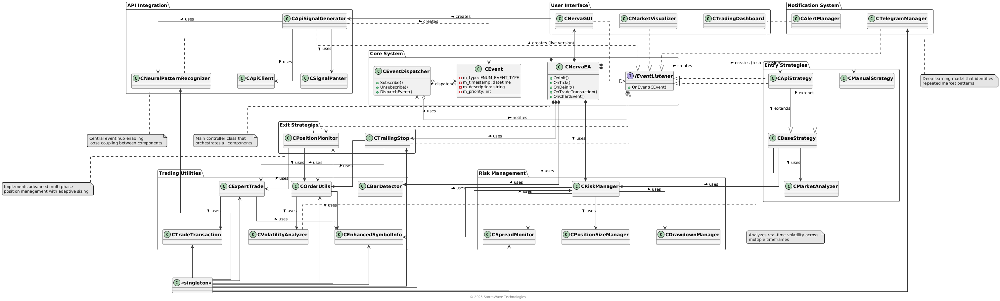

# NervaTradeAI - MetaTrader 5 Expert Advisor

NervaTradeAI combines computer vision and machine learning trained on Google TPUs to analyze markets and execute trades. It features advanced money management to maximize profits while minimizing risk exposure.

## Getting Started with NervaTrade

Before installing the Expert Advisor, you need to set up your NervaTrade account and API keys:

1. **Create your NervaTrade account**
   - Visit [https://app.nervatrade.com](https://app.nervatrade.com)
   - Sign up for an account

2. **Set up your Google Gemini API key**
   - Go to [Google AI Studio](https://ai.google.dev/)
   - Create a Gemini API key
   - Copy your API key

3. **Configure your NervaTrade prompt model**
   - Return to [https://app.nervatrade.com](https://app.nervatrade.com)
   - Navigate to the Prompt Models section
   - Create a new prompt model
   - Paste your Gemini API key
   - Configure your model settings

4. **Generate your NervaTrade API key**
   - From your dashboard, create a new NervaTrade API key
   - Save this API key - you'll need it to configure the Expert Advisor

## The Rise of AI Vibe Trading

Trading has evolved beyond traditional technical analysis into a new paradigm: AI-driven vibe trading. This innovative approach leverages the power of artificial intelligence to capture market sentiment and identify opportunities that conventional strategies might miss.

### What is Vibe Trading?

Vibe trading represents the next evolution in financial market analysis - using advanced AI to detect subtle patterns and "vibes" in market movements that are invisible to human traders. By processing vast amounts of data across multiple timeframes, NervaTrade's algorithms can sense shifts in market psychology before they manifest in price.

### How Vibe Trading Works

1. **Express Your Strategy**
   - Describe your trading approach in natural language, just as you would explain it to another trader
   - No coding knowledge required - simply write what you want in plain English

2. **AI Translation**
   - N.E.R.V.A. translates your prompts into sophisticated, executable trading algorithms
   - Complex strategies are implemented without writing a single line of code

3. **Automated Execution**
   - Your strategy runs automatically, removing human bias and emotion from decision-making
   - The system adapts to changing market conditions based on your defined parameters

### NervaTrade's AI Advantage

NervaTrade sits at the intersection of cutting-edge technology and financial markets:

- **Advanced Pattern Recognition**: Our neural networks identify complex correlations that traditional indicators cannot detect
- **Multi-Dimensional Analysis**: Simultaneous evaluation of multiple timeframes provides deeper market context
- **Adaptive Learning**: The system continuously improves by analyzing its own performance
- **Sentiment Integration**: Market sentiment is factored into every trading decision

By deploying these AI capabilities through MetaTrader 5, we've democratized access to institutional-grade trading technology, allowing retail traders to compete on a level playing field with professionals.

## Installation Guide

### Prerequisites
- MetaTrader 5 platform installed on your computer
- A trading account with a broker that supports MetaTrader 5
- Internet connection for API communication

### Installation Steps

1. **Download the Expert Advisor Files**
   - Download both `NervaTradeAI.ex5` and `NervaTradeAI_TESTER.ex5` from this repository

2. **Install the Expert Advisor in MetaTrader 5**
   - Open your MetaTrader 5 platform
   - Go to `File` > `Open Data Folder` to open your MetaTrader 5 data directory
   - Navigate to `MQL5\Experts` folder
   - Copy the downloaded `.ex5` files into this folder
   - Restart MetaTrader 5 to ensure the files are recognized

3. **Attach the EA to a Chart**
   - Open a chart for the currency pair you wish to trade
   - In the Navigator panel (Press Ctrl+N if not visible), expand the "Expert Advisors" section
   - Find "NervaTradeAI" in the list, and drag it onto your chart
   - A configuration window will appear

## Configuration

### Enabling Automated Trading

Before using the EA, you need to enable automated trading in MetaTrader 5:

1. Click the "AutoTrading" button in the top toolbar (or press Alt+T)
2. Go to `Tools` > `Options` > `Expert Advisors`
3. Make sure the following options are enabled:
   - Allow automated trading
   - Allow WebRequest for listed URL
   
4. In the "WebRequest" field, add:
   ```
   https://api.nervatrade.com
   ```
   
5. Click "OK" to save the settings

### EA Parameters

Configure the following main parameters:

#### API Settings
- **API Key**: Your NervaTrade API key
- **Prompt Model ID**: Your model ID
- **API Check Timeframe**: Timeframe for API checks

#### Risk Management
- **Maximum Floating Drawdown**: Maximum allowed drawdown percentage
- **Maximum Open Positions**: Limit of concurrent open positions

#### Position Sizing
- **Percentage of Equity per Trade**: Risk per trade (%)
- **Commission per Lot**: Your broker's commission

#### Exit Strategies
- Configure take profit, trailing stop, and other exit parameters according to your strategy

### Telegram Notifications (PRO and PREMIUM Users Only)

To receive trade notifications via Telegram:

1. Enable the Telegram API endpoint in MetaTrader 5:
   - Go to `Tools` > `Options` > `Expert Advisors`
   - Add the following URL to the "WebRequest" field:
   ```
   https://api.telegram.org
   ```

2. Create a Telegram Bot:
   - Open Telegram and search for "BotFather"
   - Start a chat with BotFather and send `/newbot`
   - Follow the instructions to name your bot
   - Once created, you'll receive a Bot Token (looks like `123456789:ABCdefGhIJKlmNoPQRsTUVwxyZ`)
   - Save this token

3. Get your Chat ID:
   - For personal notifications:
     - Search for "userinfobot" in Telegram
     - Start a chat and it will reply with your Chat ID
   - For group notifications:
     - Add your bot to a group
     - Send a message in the group mentioning the bot
     - Visit: `https://api.telegram.org/bot<YourBOTToken>/getUpdates`
     - Find the "chat" object that contains your "id" (will be negative for groups)

4. Configure Telegram Parameters in the EA:
   - **Telegram Bot Token**: Enter your bot token
   - **Telegram Chat ID**: Enter your chat or group ID
   - Enable desired alerts:
     - Position count alerts
     - Position open/close alerts
     - Drawdown alerts

## Regular vs. Tester Version

This repository includes two versions of the Expert Advisor:

### NervaTradeAI.ex5
- The standard version for live trading on real or demo accounts
- Uses a specific UI library for its interface
- Cannot be used in the MetaTrader 5 Strategy Tester due to interface library incompatibility

### NervaTradeAI_TESTER.ex5
- Specifically designed for backtesting in MetaTrader 5 Strategy Tester
- Includes manual trading buttons in the interface to open positions during testing
- Uses a different UI library compatible with the Strategy Tester
- Functionally identical to the standard version in terms of trading logic and strategy

**Note:** Both versions offer the same trading functionality and strategy implementation. The only difference is in the interface library used, which affects their compatibility with the Strategy Tester.

## System Architecture

NervaTradeAI is built on a sophisticated event-driven architecture that integrates multiple components to create a robust trading system. The diagram below illustrates the high-level structure and relationships between the key components:



The NervaTradeAI system utilizes an event-driven architecture where components communicate through a central event dispatching system. This design provides several advantages:

1. **Loose Coupling**: Components interact through events rather than direct calls, making the system more modular and maintainable.

2. **Extensibility**: New components can be added by implementing the IEventListener interface and subscribing to relevant events.

3. **Separation of Concerns**: 
   - **Entry Strategies**: Handle trade entry signals from API or manual inputs
   - **Exit Strategies**: Manage position exits through trailing stops and adaptive position adjustment
   - **Risk Management**: Control position sizing, spread monitoring, and drawdown protection
   - **API Integration**: Connect to external trading signal providers with neural pattern recognition
   - **Trading Utilities**: Provide market data and order execution functionality with volatility analysis
   - **Notification System**: Send alerts and manage communications

4. **Advanced Analysis Components**:
   - **Neural Pattern Recognition**: Identifies recurring market patterns using machine learning
   - **Market Sentiment Analysis**: Evaluates market emotions and sentiment indicators
   - **Volatility Analysis**: Calculates and normalizes volatility across timeframes
   - **Position Size Management**: Optimizes trade size based on risk parameters

5. **Singleton Pattern**: Key components are implemented as singletons to ensure a single point of responsibility and state management across the system.

6. **Dual Interface Mode**: 
   - Regular version with full GUI for live trading
   - Tester version with manual controls for backtesting

This architecture allows the system to handle complex trading scenarios while maintaining code organization and enabling future enhancements.

## Support

For questions or support, please contact:
- Website: [https://nervatrade.com](https://nervatrade.com)
- Email: support@nervatrade.com

---

© 2025 StormWave Technologies 